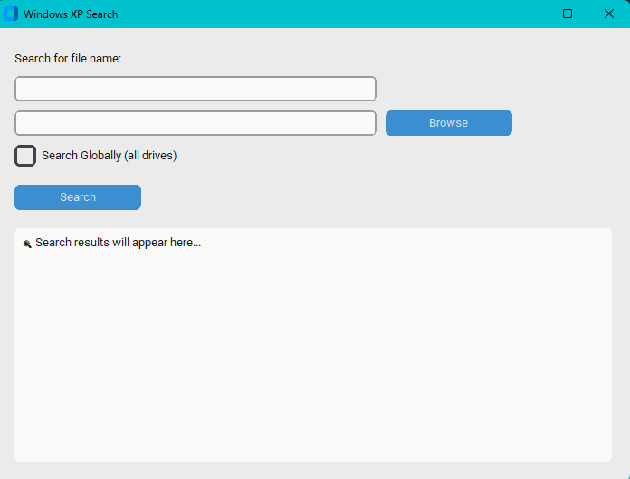

# 🔍 search-bob

> Fast. Retro. Powerful.  
> **search-bob** is a Windows XP–styled file search app with a Python UI and blazing-fast C backend.



---

## 🪟 Features

- 🎨 Beautiful Windows XP–style UI using CustomTkinter
- ⚡ Super-fast file searching using compiled `search.exe` backend
- 🌍 Global drive-wide search support
- 📁 Folder-specific local search

---

## 🧩 No Installation Required

Just download the ZIP from the [Releases](https://github.com/plagzee/search-bob/releases) tab and extract it.

```bash
📦 search-bob/
├── search_bob.exe       # Main app (double-click to run)
├── search.exe           # C backend search engine
```


---

## 🚀 Usage

1. Launch `search_bob.exe`
2. Type a filename (e.g., `photo.png`)
3. Choose a folder **or** enable **Global Search**
4. Click `Search`
5. Browse results and **right-click → Show in Explorer**

---

## 🧠 How It Works

```mermaid
graph LR
    A[Python UI] --> B[Writes to search.bin]
    B --> C[search.exe (C backend)]
    C --> D[Writes to searched.bin]
    D --> E[Python UI loads & displays results]
```

---

## 🔧 Developers

### 🔨 Build Python App

> Requires Python 3.10+, CustomTkinter, and PyInstaller

```bash
pyinstaller --noconfirm --windowed --onefile ^
--name search_bob ^
--icon icon.ico ^
--add-data "search.exe;." ^
--add-data "assets;assets" ^
--add-data "themes;themes" ^
--add-data "docs;docs" ^
--add-data "config.ini;." ^
ui/app_ui.py
```

### ⚙️ Build Backend (C)

> Requires GCC (e.g., MinGW on Windows)

```bash
gcc main.c -o search.exe
```

---

## 📃 License

MIT License

---